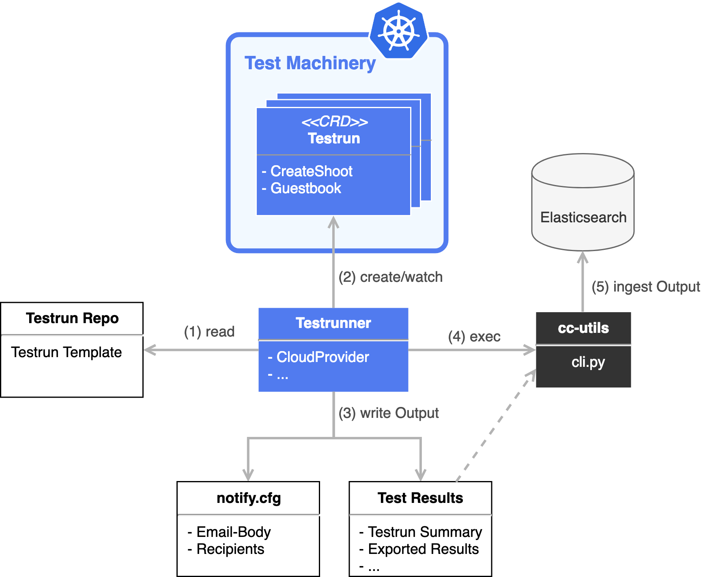

# Testrunner

Testrunner is an additional component of the Test Machinery that abstracts templating, deploying and watching of Testruns and provide additional functionality like storing test results or notifying test-owners.

- [Testrunner](#testrunner)
  - [Usage](#usage)
  - [Pipeline Usage](#pipeline-usage)
    - [Component Descriptor](#component-descriptor)
    - [Shoot Flavor](#shoot-flavor-configuration)
  - [run-template cmd](#run-template)


<p align="center">
  
</p>

## Usage

The testrunner is a basic go commandline tool that can be run by either calling it directly via
```
go run -mod=vendor cmd/testrunner/main.go [flags]
```
or via the prebuild binary which is updated and kept in sync with each new Test Machinery version (also available in the image `eu.gcr.io/gardener-project/gardener/testmachinery/testmachinery-run`)
```
testrunner [flags]
```

Available commands ([technical detailed docs](testrunner.md)):
* [run-template](#run-template)
* run-testrun
* collect

## Pipeline Usage

The default usage of the testrunner is in a CI/CD pipeline with the helm templating command.
In addition results of the helm-templated testruns are collected and stored in a database.

The templating for default landscape tests can be used via
```
testrunner run|run-tmpl [flags]
```

Templating for gardener full lifecycle test can be used via
```
testrunner run-gardener-template [flags]
```
:warning: As this command is intended to run in a CI/CD pipeline it depends on the gardener [cc-utils](https://github.com/gardener/cc-utils) library to store test results in an elasticsearch database.

### Component Descriptor

See `cc-utils` repo and [documentation](https://gardener.github.io/cc-utils/traits/component_descriptor.html) for full documentation of how it is calculated in the gardener project.

A component descriptor (BOM - Bill of Materials) describes all dependencies like github repositories (modules) and docker images of a project.

The structure of a component descriptor:
```yaml
components:
- name: component_name
  version: component_version
  dependencies:
    components:
    - name: component_dependency_name # e.g. github.com/gardener/test-infra
      version: component_dependency_version # e.g 0.12.2
    container_images:
    - image_reference: "" # eg. k8s.gcr.io/hyperkube:v1.11.6
      name: "" # e.g. hyperkube-1.13.2
      version: "" # e.g. 1.13.2
    generic:
    - name: "" # e.g. CoreOS
      version: "" # 1967.3.0
```

### Shoot Flavor Configuration

The testrunner can render testruns from helm templates and multiply them to cover a specified test matrix of shoots.
As gardener supports multiple shoot flavors of different cloudproviders, operating-systems etc.,
these shoot flavors are described a config file.

This config file has the following structure.<br>
:warning: Every possible combination that can be described in the config will result in its own shoot.
For example: 3 kubernetes versions and 4 worker pools will result in 12 different shoot tests.

```yaml
flavors:
- provider: aws|gcp|azure|alicloud|openstack|...
  kubernetes:
    pattern: "latest|<semver constraint>" # latest or semver constraint see https://github.com/Masterminds/semver#checking-version-constraints
    filterPatchVersions: true|false # filter patch versions and only keep the latest patch versions per minor
    versions: # list of specific versions to test (a version is a expirable version as defined in the cloudprofiles)
    - version: "<specific version>"
  cloudprofile: "<cloudpropfile name>"
  projectName: "<project name>" # project name without its gardener namespace prefix 'garden-'
  secretBinding: "<secret binding name to infrastructure secret>"
  region: "<region name>" # region where the cluster should be created
  zone: "<zone name>" # zone to create the cluster; currently only one zone is supported
  workers:
  - workerPools:
    - <raw gardener worker configuration>
  infrastructureConfig: {} # optional, raw gardener infrastructure provider config
  networkingConfig: {} # optional, raw gardener networking config
  controlplaneConfig: {} # optional, raw gardener controlplane config
  chartPath: "path/to/chart" # optional, absolute or relative path to the helm chart conatining testruns. Path is relativ to testrunner binary
```

Example:
```yaml
flavors:
- provider: aws
  kubernetes:
    pattern: "latest"
  cloudprofile: aws
  projectName: it
  secretBinding: shoot-operator-aws
  region: eu-west-1
  zone: eu-west-1c
  workers:
  - workerPools:
    - name: worker-1
      machine:
        type: m5.large
        image:
          name: coreos
          version: latest
        # architecture: amd64 # optional
      minimum: 1
      maximum: 2
      volume:
        size: 30Gi
        type: gp2
      zones:
      - eu-west-1c
```

## run-template

### Templating Configuration

| flag | default | description | required
| ---- | ---- | ---- | --- |
| tm-kubeconfig-path | | Path to the kubeconfig of the cluster running the Test Machinery | x |
| testruns-chart-path | | Path to the Testrun helm template that should be deployed. (Additional information about the parameters can be found [here](#helm-template)) | x |
| testrun-prefix | | Prefix of the deployed Testrun. This prefix is used for the `metadata.generateName` of Testruns in the helm template. | x |
| namespace | default | Namespace where the testrun is deployed. |  |
| timeout | 3600 | Max seconds to wait for all Testruns to finish. | |
| all-k8s-versions | false | Run the testrun with all available versions of the specified cloudprovider. :warning: The `k8s-version` is ignored if this parameter is set to true.| |
| output-file-path | "./testout" | The filepath where the test summary and results should be written to. | |
| s3-endpoint | EnvVar ("S3_ENDPOINT") | Accessible S3 endpoint of the s3 storage used by argo. This parameter is needed when tests export test results and the testrunner needs to fetch them and add them to the summary. | |
| s3-ssl | false | Enables ssl support for the corresponding s3 storage. | |
| es-config-name | | Elasticsearch server config name that is used with the cc-utils cli | |
| concourse-onError-dir | EnvVar ("ON_ERROR_DIR") | Directory where the `notify.cfg` should be written to. | |

### Helm Template Format

The Testrunner integrates the helm templating engine and uses it to simplify the specification of different Testruns with different purposes.
It it also supported to have multiple testruns in one helm chart which all can be handled by the testrunner.

The helm charts need to have a specific format to be properly handled.

:information_source: The `generateName` attribute is automatically set by the Test Machinery using the commandline provided prefix.


```yaml
apiVersion: testmachinery.sapcloud.io/v1beta1
kind: Testrun
metadata:
  namespace: default
spec:

  ttlSecondsAfterFinished: 172800 # 2 days

  testLocations:
  - type: git
    repo: https://github.com/gardener/test-infra.git
    revision: master
  - type: git
    repo: https://github.com/gardener/gardener.git
    revision: d102d6d088490e5e59d88e4137ee954842be82ac

  kubeconfigs:
    gardener: {{ b64enc .Values.kubeconfigs.gardener }}

  config:
    - name: PROJECT_NAMESPACE
      type: env
      value: {{ .Values.shoot.projectNamespace }}
    - name: SHOOT_NAME
      type: env
      value: {{ .Values.shoot.name }}
    - name: CLOUDPROVIDER
      type: env
      value: {{ .Values.shoot.cloudprovider | default "gcp" }}
    - name: K8S_VERSION
      type: env
      value: {{ .Values.shoot.k8sVersion | default "1.12.4" }}

  testFlow:
    - name: create-shoot
      definition:
        name: create-shoot
        config:
        - name: CLOUDPROFILE
          type: env
          value: {{ .Values.shoot.cloudprofile | default "gcp" }}
        - name: SECRET_BINDING
          type: env
          value: {{ .Values.shoot.secretBinding }}
        - name: REGION
          type: env
          value: {{ .Values.shoot.region }}
        - name: ZONE
          type: env
          value: {{ .Values.shoot.zone }}
        {{ if .Values.shoot.machine.type }}
        - name: MACHINE_TYPE
          type: env
          value: {{ .Values.shoot.machine.type }}
        {{ end }}
        {{ if .Values.shoot.machine.image }}
        - name: MACHINE_IMAGE
          type: env
          value: {{ .Values.shoot.machine.image }}
        {{ end }}
        {{ if .Values.shoot.machine.imageVersion }}
        - name: MACHINE_IMAGE_VERSION
          type: env
          value: {{ .Values.shoot.machine.imageVersion }}
        {{ end }}
        {{ if .Values.shoot.autoscalerMin }}
        - name: AUTOSCALER_MIN
          type: env
          value: {{ .Values.shoot.autoscalerMin }}
        {{ end }}
        {{ if .Values.shoot.autoscalerMax }}
        - name: AUTOSCALER_MAX
          type: env
          value: {{ .Values.shoot.autoscalerMax }}
        {{ end }}

    - name: tests
      dependsOn: [ create-shoot ]
      definition:
        label: default
        continueOnError: true
    - name: delete-shoot
      dependsOn: [ tests ]
      definition:
        name: delete-shoot

  onExit:
    - name: delete-shoot
      definition:
        name: delete-shoot

```
